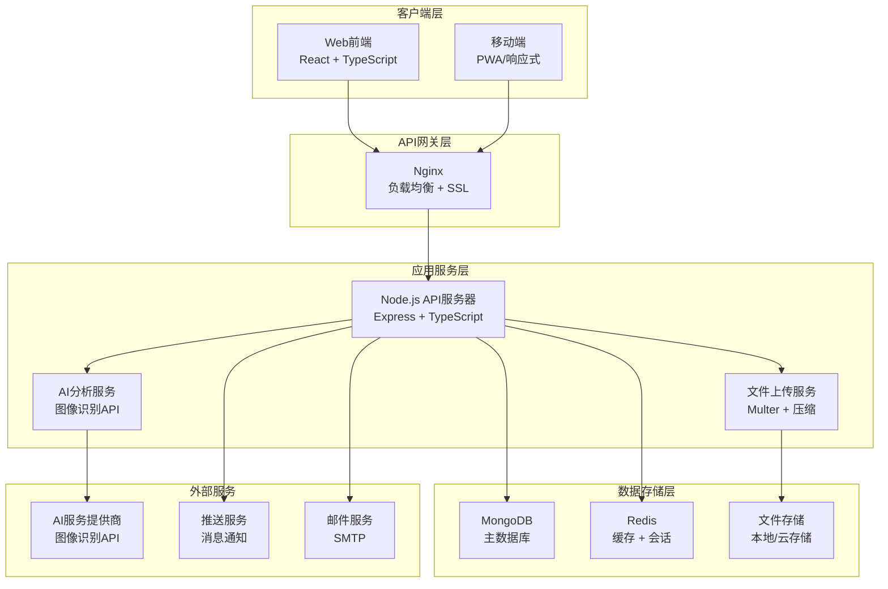

# 宠物健康监测社区平台设计文档

## 概述

本文档详细描述了宠物健康监测社区平台的系统架构、组件设计、数据模型和接口规范。系统采用前后端分离架构，支持Web和移动端访问。

## 系统架构

### 整体架构图



### 技术栈选择

#### 前端技术栈
- **React 18**: 现代化的用户界面框架
- **TypeScript**: 类型安全和更好的开发体验
- **Tailwind CSS**: 实用优先的CSS框架
- **React Router**: 客户端路由管理
- **Axios**: HTTP客户端
- **React Hook Form**: 表单处理
- **Chart.js**: 数据可视化
- **React Dropzone**: 文件上传组件

#### 后端技术栈
- **Node.js**: JavaScript运行时
- **Express**: Web应用框架
- **TypeScript**: 类型安全的JavaScript
- **MongoDB**: NoSQL文档数据库
- **Mongoose**: MongoDB对象建模
- **JWT**: 身份验证
- **Multer**: 文件上传处理
- **bcryptjs**: 密码加密
- **Redis**: 缓存和会话存储

## 组件架构

### 前端组件结构

```
src/
├── components/           # 可复用组件
│   ├── common/          # 通用组件
│   │   ├── Button/
│   │   ├── Modal/
│   │   ├── Loading/
│   │   └── Toast/
│   ├── layout/          # 布局组件
│   │   ├── Header/
│   │   ├── Sidebar/
│   │   └── Footer/
│   └── business/        # 业务组件
│       ├── PetCard/
│       ├── AnalysisResult/
│       ├── RecordChart/
│       └── PostCard/
├── pages/               # 页面组件
│   ├── Home/
│   ├── Analysis/
│   ├── Records/
│   ├── Community/
│   └── Profile/
├── hooks/               # 自定义Hooks
│   ├── useAuth.ts
│   ├── useUpload.ts
│   └── useAnalysis.ts
├── services/            # API服务
│   ├── api.ts
│   ├── auth.ts
│   ├── analysis.ts
│   └── community.ts
├── store/               # 状态管理
│   ├── authStore.ts
│   ├── petStore.ts
│   └── analysisStore.ts
└── utils/               # 工具函数
    ├── constants.ts
    ├── helpers.ts
    └── validators.ts
```

### 后端服务结构

```
src/
├── controllers/         # 控制器
│   ├── authController.ts
│   ├── userController.ts
│   ├── petController.ts
│   ├── analysisController.ts
│   └── communityController.ts
├── models/              # 数据模型
│   ├── User.ts
│   ├── Pet.ts
│   ├── PoopRecord.ts
│   ├── CommunityPost.ts
│   └── Comment.ts
├── routes/              # 路由定义
│   ├── auth.ts
│   ├── users.ts
│   ├── pets.ts
│   ├── analysis.ts
│   └── community.ts
├── middleware/          # 中间件
│   ├── auth.ts
│   ├── validation.ts
│   ├── upload.ts
│   └── errorHandler.ts
├── services/            # 业务服务
│   ├── aiService.ts
│   ├── imageService.ts
│   ├── notificationService.ts
│   └── emailService.ts
├── utils/               # 工具函数
│   ├── database.ts
│   ├── logger.ts
│   └── helpers.ts
└── config/              # 配置文件
    ├── database.ts
    ├── redis.ts
    └── constants.ts
```

## 数据模型设计

### 用户模型 (User)

```typescript
interface User {
  _id: ObjectId;
  username: string;           // 用户名，唯一
  email: string;             // 邮箱，唯一
  password: string;          // 加密后的密码
  avatar?: string;           // 头像URL
  profile: {
    firstName?: string;
    lastName?: string;
    phone?: string;
    location?: string;
    bio?: string;
  };
  preferences: {
    notifications: boolean;
    emailUpdates: boolean;
    language: string;
  };
  stats: {
    totalAnalysis: number;
    totalPosts: number;
    reputation: number;
  };
  isActive: boolean;
  isVerified: boolean;
  lastLoginAt?: Date;
  createdAt: Date;
  updatedAt: Date;
}
```

### 宠物模型 (Pet)

```typescript
interface Pet {
  _id: ObjectId;
  name: string;              // 宠物名称
  type: 'dog' | 'cat' | 'other';
  breed?: string;            // 品种
  gender?: 'male' | 'female';
  age?: number;              // 年龄（月）
  weight?: number;           // 体重（kg）
  avatar?: string;           // 头像URL
  description?: string;      // 描述
  medicalHistory?: {
    allergies: string[];
    medications: string[];
    conditions: string[];
  };
  ownerId: ObjectId;         // 主人ID
  isActive: boolean;
  createdAt: Date;
  updatedAt: Date;
}
```

### 便便记录模型 (PoopRecord)

```typescript
interface PoopRecord {
  _id: ObjectId;
  petId: ObjectId;           // 宠物ID
  userId: ObjectId;          // 用户ID
  imageUrl: string;          // 图片URL
  thumbnailUrl?: string;     // 缩略图URL
  analysis: {
    shape: 'type1' | 'type2' | 'type3' | 'type4' | 'type5' | 'type6' | 'type7';
    healthStatus: 'healthy' | 'warning' | 'concerning';
    confidence: number;      // 置信度 0-100
    details: string;         // 详细分析
    recommendations: string[];
  };
  userNotes?: string;        // 用户备注
  symptoms?: string[];       // 相关症状
  timestamp: Date;           // 记录时间
  location?: {
    latitude: number;
    longitude: number;
  };
  weather?: {
    temperature: number;
    humidity: number;
  };
  isShared: boolean;         // 是否分享到社区
  createdAt: Date;
  updatedAt: Date;
}
```

### 社区帖子模型 (CommunityPost)

```typescript
interface CommunityPost {
  _id: ObjectId;
  userId: ObjectId;          // 发布者ID
  petId?: ObjectId;          // 相关宠物ID
  title: string;             // 标题
  content: string;           // 内容
  images: string[];          // 图片URLs
  tags: string[];            // 标签
  category: 'health' | 'help' | 'experience' | 'general';
  status: 'published' | 'draft' | 'archived';
  interactions: {
    likes: ObjectId[];       // 点赞用户IDs
    views: number;           // 浏览次数
    shares: number;          // 分享次数
  };
  comments: ObjectId[];      // 评论IDs
  isSticky: boolean;         // 是否置顶
  isFeatured: boolean;       // 是否精选
  moderationStatus: 'approved' | 'pending' | 'rejected';
  createdAt: Date;
  updatedAt: Date;
}
```

### 评论模型 (Comment)

```typescript
interface Comment {
  _id: ObjectId;
  postId: ObjectId;          // 帖子ID
  userId: ObjectId;          // 评论者ID
  parentId?: ObjectId;       // 父评论ID（用于回复）
  content: string;           // 评论内容
  likes: ObjectId[];         // 点赞用户IDs
  isDeleted: boolean;
  moderationStatus: 'approved' | 'pending' | 'rejected';
  createdAt: Date;
  updatedAt: Date;
}
```

## API接口设计

### 认证接口

```typescript
// POST /api/auth/register
interface RegisterRequest {
  username: string;
  email: string;
  password: string;
}

interface RegisterResponse {
  success: boolean;
  data: {
    token: string;
    user: UserProfile;
  };
}

// POST /api/auth/login
interface LoginRequest {
  email: string;
  password: string;
}

interface LoginResponse {
  success: boolean;
  data: {
    token: string;
    user: UserProfile;
  };
}
```

### 分析接口

```typescript
// POST /api/analysis/upload
interface AnalysisRequest {
  petId: string;
  image: File;
  notes?: string;
  symptoms?: string[];
}

interface AnalysisResponse {
  success: boolean;
  data: {
    id: string;
    analysis: AnalysisResult;
    recommendations: string[];
  };
}

// GET /api/analysis/records/:petId
interface RecordsResponse {
  success: boolean;
  data: {
    records: PoopRecord[];
    pagination: PaginationInfo;
    statistics: {
      totalRecords: number;
      healthyCount: number;
      warningCount: number;
      concerningCount: number;
      averagePerWeek: number;
    };
  };
}
```

### 社区接口

```typescript
// GET /api/community/posts
interface PostsRequest {
  page?: number;
  limit?: number;
  category?: string;
  tags?: string[];
  search?: string;
}

interface PostsResponse {
  success: boolean;
  data: {
    posts: CommunityPost[];
    pagination: PaginationInfo;
    categories: CategoryInfo[];
  };
}

// POST /api/community/posts
interface CreatePostRequest {
  title: string;
  content: string;
  petId?: string;
  images?: string[];
  tags?: string[];
  category: string;
}
```

## 安全设计

### 身份验证与授权

1. **JWT令牌机制**
   - 访问令牌：短期有效（15分钟）
   - 刷新令牌：长期有效（7天）
   - 令牌轮换机制

2. **权限控制**
   - 基于角色的访问控制（RBAC）
   - 资源级别的权限验证
   - API速率限制

3. **数据加密**
   - 密码使用bcrypt加密
   - 敏感数据传输使用HTTPS
   - 数据库连接加密

### 输入验证与防护

1. **输入验证**
   - 服务端数据验证
   - SQL注入防护
   - XSS攻击防护

2. **文件上传安全**
   - 文件类型验证
   - 文件大小限制
   - 病毒扫描
   - 安全的文件存储

## 性能优化

### 前端优化

1. **代码分割**
   - 路由级别的懒加载
   - 组件级别的动态导入
   - 第三方库的按需加载

2. **资源优化**
   - 图片压缩和WebP格式
   - CSS和JS文件压缩
   - CDN加速

3. **缓存策略**
   - 浏览器缓存
   - Service Worker缓存
   - API响应缓存

### 后端优化

1. **数据库优化**
   - 索引优化
   - 查询优化
   - 连接池管理

2. **缓存机制**
   - Redis缓存热点数据
   - 查询结果缓存
   - 会话缓存

3. **异步处理**
   - 图片处理异步化
   - AI分析队列处理
   - 邮件发送异步化

## 监控与日志

### 应用监控

1. **性能监控**
   - API响应时间
   - 数据库查询性能
   - 内存和CPU使用率

2. **错误监控**
   - 异常捕获和报告
   - 错误日志聚合
   - 实时告警机制

3. **业务监控**
   - 用户行为分析
   - 功能使用统计
   - 转化率监控

### 日志管理

1. **日志分类**
   - 访问日志
   - 错误日志
   - 业务日志
   - 安全日志

2. **日志存储**
   - 结构化日志格式
   - 日志轮转机制
   - 长期存储策略

## 部署架构

### 容器化部署

```yaml
# docker-compose.yml
version: '3.8'
services:
  frontend:
    build: ./frontend
    ports:
      - "3000:3000"
    environment:
      - REACT_APP_API_URL=http://backend:5000
  
  backend:
    build: ./backend
    ports:
      - "5000:5000"
    environment:
      - MONGODB_URI=mongodb://mongo:27017/pet-health
      - REDIS_URL=redis://redis:6379
    depends_on:
      - mongo
      - redis
  
  mongo:
    image: mongo:5.0
    volumes:
      - mongo_data:/data/db
    ports:
      - "27017:27017"
  
  redis:
    image: redis:7-alpine
    ports:
      - "6379:6379"
  
  nginx:
    image: nginx:alpine
    ports:
      - "80:80"
      - "443:443"
    volumes:
      - ./nginx.conf:/etc/nginx/nginx.conf
    depends_on:
      - frontend
      - backend

volumes:
  mongo_data:
```

### 生产环境配置

1. **负载均衡**
   - Nginx反向代理
   - 多实例部署
   - 健康检查

2. **数据备份**
   - 数据库定期备份
   - 文件存储备份
   - 灾难恢复计划

3. **SSL证书**
   - Let's Encrypt自动续期
   - HTTPS强制重定向
   - 安全头配置

## 测试策略

### 前端测试

1. **单元测试**
   - Jest + React Testing Library
   - 组件测试
   - 工具函数测试

2. **集成测试**
   - API集成测试
   - 用户流程测试
   - 跨浏览器测试

### 后端测试

1. **单元测试**
   - Jest测试框架
   - 控制器测试
   - 服务层测试

2. **API测试**
   - Supertest集成测试
   - 数据库集成测试
   - 认证测试

3. **性能测试**
   - 负载测试
   - 压力测试
   - 并发测试

这个设计文档为系统的实现提供了详细的技术指导，确保了架构的可扩展性、安全性和性能。